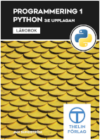
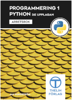

# Programmering 1 - Python - 3:e upplagan, 2016

Det här "repository" innehåller kodexempel och lösningsförslag till läroboken och arbetsboken

Utgiven av Thelin Läromedel - [www.skolportalen.se](https://www.skolportalen.se "Öppna skolportalens sida")
Författare: Jan Sundström

Tanken är att ni som använder läromedlet ska kunna komma hit och studera, ladda hem och testa mina lösningsförslag.
I dagsläget finns det mesta från kapitel 1 - 18. Materialet är med andra ord ej färdigställt.

Läroboken: Kodexempel och lösningsförslag till frågorna i Testa dig själv-avsnitten
Arbetsboken: Lösningsförslag till alla kontrollfrågor och programmeringsövningar

_Av respekt till författare och upphovsrättsliga lagar så har jag medvetet ändrat 
kodexemplen från boken. Detta i sin tur ger dig som läsare fler infallsvinklar och 
exempel på hur man kan lösa något._

Senast uppdaterad 2020-07-24

Niklas Engvall,
Borlänge

## Innehållsförteckning 

  :heavy_minus_sign: = Ingen källkod finns till avsnittet 
  :white_check_mark: = Kodexempel/övningar finns till kapitlet/avsnittet men är ej slutfört 
  :heavy_check_mark: = Alla kodexempel/övningar till kapitlet/avsnittet är färdigställda  
  [TOMT] = Ej påbörjat kapitel

### Läroboken

| Kapitel | Avsnitt                                              |  Sida  |   Status  |
| :-----: | ---------------------------------------------------- | :----: | :-------: |
|    1    | Programmering - introduktion                         |    19  | :heavy_minus_sign: |
|    1    | Testa dig själv. Frågor till kapitel 1               |    27  | :heavy_check_mark: |
|    2    | Installera python och kom igång                      |    29  | :heavy_minus_sign: |
|    2    | Testa dig själv. Frågor till kapitel 2               |    45  | :heavy_check_mark: |
|    3    | Skapa program eller skript                           |    47  | :heavy_check_mark: |
|    3    | Testa dig själv. Frågor till kapitel 3               |    53  | :heavy_check_mark: |
|    4    | Villkor, If-satser                                   |    55  | :heavy_check_mark: |
|    4    | Testa dig själv. Frågor till kapitel 4               |    61  | :heavy_check_mark: |
|    5    | Loopar - upprepning, itteration                      |    63  | :heavy_check_mark: |
|    5    | Testa dig själv. Frågor till kapitel 5               |    73  | :heavy_check_mark: |
|    6    | Mer om teckensträngar i Python                       |    75  | :heavy_check_mark: |
|    6    | Testa dig själv. Frågor till kapitel 6               |    85  | :heavy_check_mark: |
|    7    | Ettor och nollor                                     |    87  | :heavy_check_mark: |
|    7    | Testa dig själv. Frågor till kapitel 7               |    93  | :heavy_check_mark: |
|    8    | Listor och tipplar                                   |    95  | :heavy_check_mark: |
|    8    | Testa dig själv. Frågor till kapitel 8               |   105  | :heavy_check_mark: |
|    9    | Funktioner                                           |   107  | :heavy_check_mark: |
|    9    | Testa dig själv. Frågor till kapitel 9               |   119  | :heavy_check_mark: |
|   10    | Slumptal i programmering                             |   121  | :heavy_check_mark: |
|   10    | Testa dig själv. Frågor till kapitel 10              |   127  | :heavy_check_mark: |
|   11    | Felhantering i Python                                |   129  | :heavy_check_mark: |
|   11    | Testa dig själv. Frågor till kapitel 11              |   133  | :heavy_check_mark: |
|   12    | Sköldpaddsgrafik                                     |   135  | :heavy_check_mark: |
|   13    | Rekursion - funktioner som anropar sig själva        |   159  | :heavy_check_mark: |
|   14    | Sökning                                              |   163  | :heavy_minus_sign: |
|   15    | Sorteringar                                          |   165  | :heavy_check_mark: |
|   15    | Testa dig själv. Frågor till kapitel 15              |   179  | :heavy_check_mark: |          
|   16    | Mer om listor och dictionaries                       |   181  | :heavy_check_mark: |
|   16    | Testa dig själv. Frågor till kapitel 16              |   191  | :heavy_check_mark: |
|   17    | Teckentabeller                                       |   193  | :heavy_check_mark: |
|   17    | Testa dig själv. Frågor till kapitel 17              |   205  | :heavy_check_mark: |
|   18    | Filhantering                                         |   207  | :heavy_check_mark: |
|   18    | Testa dig själv. Frågor till kapitel 18              |   215  | :heavy_check_mark: |
|   19    | Klasser och objekt                                   |   217  |           |
|   19    | Testa dig själv. Frågor till kapitel 19              |   222  |           |
|   20    | Länkade listor och andra datastrukturer              |   229  |           |
|   20    | Testa dig själv. Frågor till kapitel 20              |   239  |           |
|   21    | Grafiskt användarinterface med tkinter               |   241  |           |
  
  
### Arbetsboken

| Kapitel | Avsnitt                                              |  Sida  |   Status  |
| :-----: | ---------------------------------------------------- | :----: | :-------: |
|    1    | Programmering - introduktion                         |     2  | :heavy_check_mark: |
|    2    | Installera python och kom igång                      |     3  | :heavy_check_mark: |
|    3    | Skapa program eller skript                           |     5  | :heavy_check_mark: |
|    4    | Villkor, If-satser                                   |     7  | :heavy_check_mark: |
|    5    | Loopar - upprepning, itteration                      |     9  | :heavy_check_mark: |
|    6    | Mer om teckensträngar i Python                       |    14  | :heavy_check_mark: |
|    7    | Ettor och nollor                                     |    18  | :heavy_check_mark: |
|    8    | Listor och tipplar                                   |    21  | :heavy_check_mark: |
|    9    | Funktioner                                           |    22  | :heavy_check_mark: |
|   10    | Slumptal i programmering                             |    24  | :white_check_mark: |
|   11    | Felhantering i Python                                |    28  | :heavy_check_mark: |
|   12    | Sköldpaddsgrafik                                     |    29  | :white_check_mark: |
|   13    | Rekursion - funktioner som anropar sig själva        |    32  | :white_check_mark: |
|   14    | Sökning                                              |    36  | :white_check_mark: |
|   15    | Sorteringar                                          |    39  | :white_check_mark: |
|   16    | Mer om listor och dictionaries                       |    40  | :heavy_check_mark: |
|   17    | Teckentabeller                                       |    41  | :heavy_check_mark: |
|   18    | Filhantering                                         |    42  | :white_check_mark: |
|   19    | Klasser och objekt                                   |    44  |           |
|   20    | Länkade listor och andra datastrukturer              |    45  |           |
|   21    | Grafiskt användarinterface med tkinter               |    46  |           |